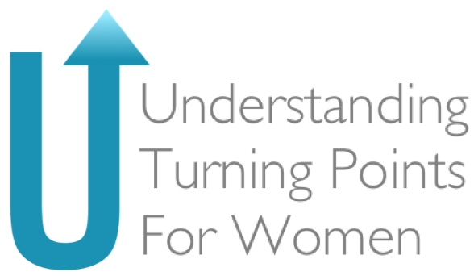

<center>
{width=50% height=40%} 
</center>


### Why *this study* and *why now*?


```{r setup, include=FALSE}
knitr::opts_chunk$set(echo = TRUE)
```


<font size = "4">Women are the fastest growing incarcerated population in the United States. There are approximately [1.2 million women under the supervision of the criminal justice system](https://www.bjs.gov/content/pub/pdf/cv18.pdf) and over 200,000 women incarcerated in jails or prisons. In 2015, [girls represented approximately 29% of all juvenile arrests and accounted for 15% of youth in placement.](https://ojjdp.ojp.gov/sites/g/files/xyckuh176/files/pubs/251486.pdf) Though researchers and policymakers increasingly recognize [the importance of understanding female offending](https://secure.ce-credit.com/articles/102134/Women_Pathways_to_Jail.pdf), there is relatively little known about the longitudinal trajectories of female offending. We also know little about the potential negative outcomes of these trajectories, and the protective and risk processes that contribute not only to persistence, but also to desistance from adult offending, specifically for women. The proposed study builds on an existing longitudinal study to further our understanding of the trajectories of female justice involvement across adolescence and adulthood. Our team will focus on understanding trajectories of trauma exposure and its sequalae, in order to identify salient points for prevention and intervention efforts.</font>

$$\\[.25in]$$


### What is a turning point?

<font size = "4">[Turning points](https://psycnet.apa.org/record/1996-06905-008) are broadly defined as an external event or experience, or as an internal event or realization, that brings about a changed sense of awareness. A key feature of turning points is that they [give people an opportunity for change](https://onlinelibrary.wiley.com/doi/abs/10.1111/j.1745-9125.1993.tb01132.x), often through social relationships.</font>
  
$$\\[.25in]$$


### What information are we collecting in this study?


{width=70% height=60%} 


